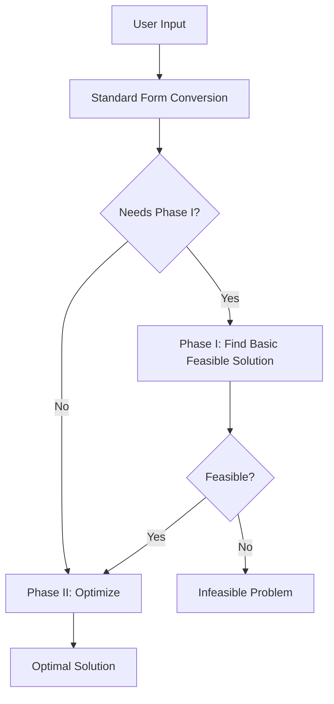

# CLAUDE.md

> [!NOTE]
> This file provides guidance to Claude Code (claude.ai/code) when working with code in this repository.

## Project Overview

This is an interactive linear programming learning application that teaches the Simplex method through step-by-step visualizations. The application is built with React, TypeScript, and Visx for data visualization.

## Common Development Commands

### Essential Commands
- **Build**: `npm run build` or `pnpm build` - Production build with TypeScript compilation
- **Lint**: `npm run lint` or `pnpm lint` - ESLint code quality check
- **Test**: `npx vitest` or `pnpm vitest` - Run all tests
- **Test (single file)**: `npx vitest src/lib/simplex-solver.test.ts` - Run specific test
- **Test (watch mode)**: `npx vitest --watch` - Auto-run tests on file changes

### Important Notes
- ❌ Don't run long-living processes like `pnpm dev` 
- ✅ Use `npx vitest` for testing instead of jest

## Core Architecture

### Algorithm Implementation (@src/lib/)

The Simplex algorithm is implemented with a Two-Phase approach:



**Key Files:**
- `simplex-solver.ts` - Main solver orchestrating both phases
- `phase-one-solver.ts` - Finds initial basic feasible solution using artificial variables
- `phase-two-solver.ts` - Optimizes the objective function
- `standard-form-conversion.ts` - Converts any LP to standard form with explanations

### Visualization Components (@src/components/)

The visualization layer displays the algorithm's progress interactively:

**Main Components:**
- `SimplexVisualizer.tsx` - Orchestrates the entire visualization flow
- `TableauVisualizer.tsx` - Interactive tableau with pivot operation highlighting
- `GeometricVisualizerVisx.tsx` - 2D feasible region and objective function visualization
- `DualityVisualizer.tsx` - Shows primal-dual relationships

### Data Flow Pattern

```typescript
// 1. User inputs problem
const problem: LinearProgram = {
  objective: [3, 2],
  constraints: [
    { coefficients: [2, 1], rhs: 10, operator: '<=' }
  ],
  isMaximization: true,
  variables: ['x1', 'x2']
};

// 2. Convert to standard form
const { standardLP, explanation } = convertToStandardFormWithExplanation(problem);

// 3. Solve with step tracking
const steps = solveWithSteps(standardLP);

// 4. Visualize each step
<SimplexVisualizer lp={standardLP} />
```

## Implementation Guidelines

### When Adding New Features

1. **Algorithm Changes** - Update both the solver logic and step generation
2. **New Visualizations** - Follow the existing pattern of step-based rendering
3. **Educational Content** - Add explanations to `StepExplanation.tsx`

### Type System

Key types to understand:
- `LinearProgram` - Problem definition with constraints and objective
- `SimplexTableau` - Current state including basis, matrix, and phase
- `SimplexStep` - Single algorithm step with status and metadata

### Testing Approach

✅ **Good Test Pattern:**
```typescript
test('handles unbounded problem correctly', () => {
  const unboundedProblem = {
    objective: [1, 0],
    constraints: [{ coefficients: [-1, 1], rhs: 1, operator: '<=' }],
    isMaximization: true
  };
  const result = solveWithSteps(unboundedProblem);
  expect(result.status).toBe('unbounded');
});
```

## Common Patterns

### Adding New Example Problems

Add to `EXAMPLE_PROBLEMS` in `app.tsx`:
```typescript
newExample: {
  objective: [5, 3],
  constraints: [
    { coefficients: [1, 1], rhs: 10, operator: '<=' }
  ],
  isMaximization: true,
  variables: ['x1', 'x2'],
  variableRestrictions: [true, true] // both non-negative
}
```

### Debugging Simplex Steps

The solver tracks detailed information for each step:
- Entering/leaving variables
- Pivot row/column
- Current tableau state
- Phase transitions

## Troubleshooting

### Common Issues

**Problem: Tests failing with tableau mismatch**
- Check if standard form conversion changed
- Verify basis variable ordering

**Problem: Visualization not updating**
- Ensure `currentStepIndex` state is properly managed
- Check if step data includes all required fields