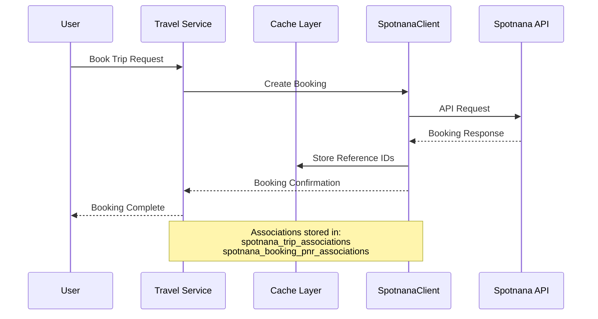
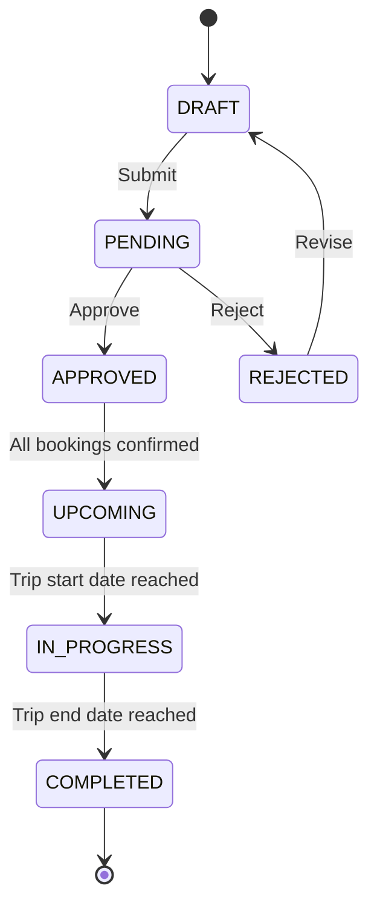

# CLAUDE.md Best Practices

> [!NOTE]
> This guide outlines best practices for creating and maintaining CLAUDE.md files across the codebase to optimize Claude's effectiveness when assisting with development tasks. If something is unclear, confusing, or an example is missing, please open a PR and tag the documentation team for a review.

## Getting Started

Before creating or updating a CLAUDE.md file, review existing CLAUDE.md files in similar areas to understand established patterns and style. For unfamiliar domains, first look for an introductory tutorial or guide to build foundational knowledge before documenting it for Claude.

## Core Principles

- **Contextual Over Comprehensive** - Provide enough context for Claude to understand the domain without overwhelming with unnecessary details
- **Domain-Specific Guidance** - Focus on unique aspects of your codebase that aren't obvious from reading the code itself
- **Structured Information** - Organize content with clear headings, lists, and sections
- **Living Documentation** - Keep CLAUDE.md files updated as the codebase evolves

## Documentation Structure

CLAUDE.md files should follow a clear hierarchical structure:

- **Root CLAUDE.md** - Serves as the main index to related domain-specific CLAUDE.md files
- **Domain-specific CLAUDE.md** - Focus on individual domains, services or components
- **Progressive Complexity** - Simple concepts first, then build to advanced topics

### Repository Root CLAUDE.md

The root CLAUDE.md should contain:

- Brief overview of the project/repository
- References to domain-specific CLAUDE.md files using the `@path/to/file.md [#tag]` syntax
- Quick reference sections for common tasks
- Explicit instructions for Claude regarding codebase conventions

#### Example from travel/CLAUDE.md:

```markdown
# Travel Domain Overview

> [!NOTE]
> This file provides high-level guidance to Claude Code when working with code in the travel domain. For more detailed implementation guidance, refer to the specific CLAUDE.md files in subdirectories.

## Subdomain Documentation

The travel domain is divided into several subdomains, each with its own CLAUDE.md file for implementation specifics:

- **Core Travel Service**: @travel/src/main/kotlin/brex/travel/CLAUDE.md - Core travel service functionality
- **Group Events**: @travel/group_events/CLAUDE.md - Group travel event management
- **Travel Jobs**: @travel/jobs/CLAUDE.md - Background jobs and scheduled tasks
- **Spotnana Integration**: @travel/src/main/kotlin/brex/travel/modules/spotnana/CLAUDE.md - Travel provider integration

## Quick Reference

When working with travel code, refer to these key resources:

### Important Files
- **Travel Application**: @travel/src/main/kotlin/brex/travel/Application.kt
- **Travel Service**: @travel/src/main/kotlin/brex/travel/modules/booking/service/TripService.kt
- **Spotnana Integration**: @travel/src/main/kotlin/brex/travel/modules/spotnana/
- **GraphQL Schema**: @travel/src/main/resources/dgs_schema/
- **External API**: @external_api/travel_api/openapi.yaml

### Core Primitives
- Trip and Booking models originate in @expense_management/trips/
- Travel domain implements Spotnana integration and extends these primitives
- Always check if an issue is in the travel layer or underlying trip primitives
```

This example demonstrates:
- Clear domain overview
- Explicit references to subdomain documentation
- Quick reference for important files and concepts
- Guidance on cross-domain dependencies

### Domain-Specific CLAUDE.md Files

For subdirectories with specific domains, follow this recommended structure:

1. **Overview** - Brief introduction with scope and purpose
2. **Core Concepts** - Fundamental principles and terminology
3. **Guidelines** - Specific rules and conventions
4. **Examples** - Practical implementations with clear explanations
5. **Advanced Topics** - More complex scenarios and edge cases
6. **Reference Links** - Cross-references to related documentation

#### Example from travel/src/main/kotlin/brex/travel/modules/spotnana/CLAUDE.md:

```markdown
# Spotnana Integration

> [!NOTE]
> This file provides guidance to Claude Code when working with the Spotnana travel provider integration.

## Integration Overview

Spotnana is Brex's travel booking provider that handles air, lodging, car rental, and rail bookings. The integration maps between Brex's travel domain models and Spotnana's API, enabling seamless booking and management of travel arrangements.

[Mermaid diagram showing integration flow...]

## Key Components

- **SpotnanaClient** - Core client for all Spotnana API interactions
- **SpotnanaBookingService** - Handles booking creation and management
- **SpotnanaCompanyProfileService** - Manages company travel settings and profiles
- **SpotnanaMappers** - Maps between Brex and Spotnana data models

## Data Mapping

### Entity Associations

The travel system uses several tables to maintain mappings between Brex entities and Spotnana references:
[...]

## API Interaction Pattern

[Example code showing interaction pattern...]

## Error Handling

[Example error handling code...]

## Troubleshooting

[Common issues and solutions...]
```

This example demonstrates:
- Domain-specific focus confined to one component
- Clear explanation of integration architecture
- Practical code examples showing implementation patterns
- Troubleshooting guidance specific to this integration

Additional recommendations:
- Focus on the "why" behind design decisions
- Document non-obvious patterns and conventions
- Provide examples of common usage patterns

## Writing Style

- **Be Concise** - Use direct language without unnecessary words
- **Use Active Voice** - "The function returns a value" instead of "A value is returned by the function"
- **Mark Good/Bad Examples** - Use ✅ for recommended practices and ❌ for anti-patterns
- **Explain Why** - Don't just describe what to do, explain the reasoning
- **Use Code Blocks** - Include formatted code examples with proper syntax highlighting

## Technical Guidelines

### Use References Efficiently
- Reference other files with `@path/to/file.md` syntax
- Keep reference chains short (avoid deep nesting)

### Formatting Standards
- Use markdown for consistent rendering
- Structure documents with clear headings (# for main titles, ## for sections)
- Place general information at the top, specific details below
- Group related concepts in sections with clear headings
- Use bullet points for lists of options/alternatives
- Use code blocks with language identifiers for examples
- Add tables for comparing options or showing complex relationships
- Use Mermaid diagrams for visualizing workflows and processes

#### Visualizing Workflows with Mermaid

Mermaid diagrams are especially valuable in CLAUDE.md files for helping Claude understand complex workflows, system interactions, and decision processes. Claude can understand and reason about these visual representations when assisting developers.

#### Example from travel/src/main/kotlin/brex/travel/modules/spotnana/CLAUDE.md:



This example shows how the Spotnana travel provider integration works, making it easy for Claude to understand the data flow between systems.

#### Example from travel/CLAUDE.md (state machine):



This state diagram shows the lifecycle of a trip through the travel system, making complex state transitions easy to visualize and understand.

**When to use Mermaid diagrams:**
- Process flows with decision points (travel booking flow)
- System architecture diagrams (service connections)
- State machines and transitions (trip status lifecycle)
- Data transformation pipelines 
- Service interaction sequences (integration with travel providers)

**Mermaid diagram types particularly useful for code assistance:**
- `flowchart` - For general processes and decisions
- `sequenceDiagram` - For API interactions and service calls (as shown in the Spotnana integration)
- `classDiagram` - For object relationships
- `stateDiagram-v2` - For state machines (as shown in the Trip lifecycle)

### Memory Management
- Break large documentation into modular files
- Put most frequently needed information in root CLAUDE.md
- Create dedicated files for specialized domains

## Common Pitfalls to Avoid

- **Documentation Overload** - Adding too much general information that's obvious from the code
- **Stale References** - Forgetting to update references when files are moved/renamed
- **Missing Context** - Not providing enough domain context for Claude to understand specialized terminology
- **Poor Organization** - Unstructured documents that make it difficult to locate specific information
- **Duplicating Information** - Creating redundant content across multiple CLAUDE.md files
- **Inconsistent Terminology** - Using different terms for the same concepts across files

## Example: Effective vs. Ineffective Documentation

### ❌ Ineffective Documentation

```markdown
# Authentication

This is the authentication module. It has functions to create and validate tokens.

The TokenGenerator class can be used to make tokens. The TokenValidator class validates them.

There are many configuration options available. The code is in the auth directory.
```

Problems with this example:
- Vague descriptions without specific details
- No explanation of why design choices were made
- No examples of usage patterns
- No references to related documentation

### ✅ Effective Documentation

```markdown
# Authentication Service

This service handles user authentication using JWT tokens with asymmetric RS256 signing.

## Key Components
- `TokenGenerator`: Creates tokens with configurable expiry (default: 24h)
- `TokenValidator`: Verifies tokens against public keys stored in KMS

## Common Usage Patterns

// Generate a standard user token
const token = await tokenGenerator.createToken(userId, StandardClaims);

## Implementation Notes
- Key rotation happens every 30 days (see @auth/key-rotation-service.md [#security])
- Failed validation is always logged to Datadog with `auth.token.invalid` tag
```

This effective example:
- Provides specific implementation details (JWT, RS256)
- Lists key components with their purposes
- Shows actual code examples with syntax highlighting
- Includes cross-references to related documentation
- Explains important operational details

## Maintenance Guidelines

- Review CLAUDE.md files when related code changes
- Update examples to reflect current implementations
- Add "Last Updated" dates for time-sensitive content
- Include ownership information for domain-specific docs

## For Additional Reading

- [Claude Documentation](https://docs.anthropic.com/claude/)

By following these best practices, you'll create CLAUDE.md files that help Claude provide more effective assistance with your codebase.