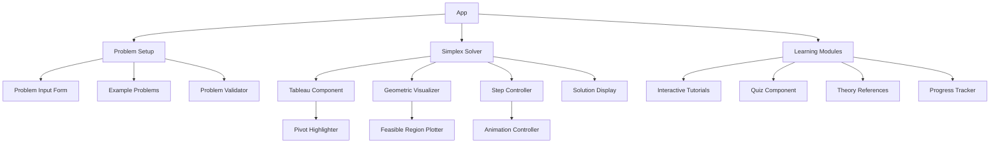

# Interactive Simplex Method Learning Application Plan

## Overview
This application will provide an interactive, visual way to understand the simplex method, helping users grasp linear programming concepts through hands-on experience and step-by-step visualization.

## Key Features

### 1. Interactive Simplex Tableau
- Step-by-step tableau operations
- Highlighting of pivot elements
- Visual tracking of basic and non-basic variables
- Real-time solution updates

### 2. Geometric Visualization
- 2D plot of constraints and feasible region
- Moving objective function contours
- Highlighting of vertices and movement along edges
- Visual correlation between tableau steps and geometric interpretation

### 3. Problem Input Interface
- Custom problem entry with variable number of constraints
- Pre-loaded example problems with varying difficulty
- Input validation and correction suggestions

### 4. Step-by-Step Learning Mode
- Guided walkthrough of simplex algorithm
- Interactive quizzes at key decision points
- Explanations for each step of the algorithm
- Visualization of the mathematical reasoning

## Component Architecture



## Core Components in Detail

### 1. SimplexTableau Component
- Interactive grid displaying the current simplex tableau
- Highlighting capabilities for:
  - Entering variable selection
  - Leaving variable selection
  - Pivot element
  - Current basic variables
- Animation of row operations during pivoting
- Display of solution status (optimal, unbounded, infeasible)

### 2. GeometricVisualizer Component
- Canvas/SVG-based visualization of:
  - Constraint lines
  - Feasible region (polygon)
  - Objective function level lines
  - Current solution point
  - Path taken through vertices
- Zoom and pan capabilities
- Synchronized with tableau operations

### 3. StepController Component
- Forward/backward navigation through simplex steps
- Auto-play with adjustable speed
- Step explanation panel
- Decision point interactivity (asking user to select entering/leaving variables)

### 4. Problem Setup Components
- Form for entering objective function and constraints
- Matrix representation input alternative
- Dropdown for example problem selection
- Standard form converter with explanation

## Learning Pathway

1. **Introduction to Linear Programming**
   - What is a linear program?
   - Understanding the standard form
   - Feasible region concepts

2. **Simplex Method Basics**
   - Slack variables and initial tableau
   - Basic and non-basic variables
   - Pivot operations explained

3. **Interactive Simplex Solver**
   - Step-by-step tableau operations
   - Selecting entering/leaving variables
   - Performing pivot operations
   - Interpreting the final solution

4. **Advanced Concepts**
   - Detecting special cases (unbounded, infeasible)
   - Degeneracy and cycling
   - Sensitivity analysis
   - Phase 1 method for finding initial BFS

## Interactive Exercises

1. **Pivot Selection Practice**
   - Given a tableau, select the correct pivot element
   - Explanation of consequences for different choices

2. **Geometric Interpretation**
   - Match tableaus to their corresponding geometric positions
   - Identify the path through vertices that simplex would take

3. **Complete Problem Solving**
   - Solve entire LP problems step-by-step
   - Compare user solutions with algorithm solution

4. **Sensitivity Analysis**
   - Adjust parameters and observe solution changes
   - Identify binding constraints and shadow prices

## Implementation Strategy

### Phase 1: Core Tableau Functionality
- Implement simplex algorithm in TypeScript
- Create basic tableau display component
- Add step-by-step controls for algorithm progression

### Phase 2: Geometric Visualization
- Add 2D plotting of constraints and feasible region
- Implement synchronized view with tableau operations
- Create animation of simplex path through vertices

### Phase 3: Interactive Learning Features
- Develop guided tutorials
- Implement quizzes and exercises
- Add theory references and explanations

### Phase 4: Advanced Features
- Support for Phase 1 method
- Sensitivity analysis visualization
- Performance optimizations for complex problems

## Component Interface Examples

### SimplexTableau Props
```typescript
interface SimplexTableauProps {
  tableau: number[][];
  basicVariables: number[];
  enteringColumn: number | null;
  leavingRow: number | null;
  pivotElement: [number, number] | null;
  onCellClick?: (row: number, col: number) => void;
  highlightMode?: 'none' | 'entering' | 'leaving' | 'pivot';
  showReducedCosts?: boolean;
}
```

### GeometricVisualizer Props
```typescript
interface GeometricVisualizerProps {
  constraints: {
    coefficients: number[];
    rhs: number;
    operator: '<=' | '>=' | '=';
  }[];
  objective: {
    coefficients: number[];
    isMaximization: boolean;
  };
  currentVertex?: number[];
  path?: number[][];
  showObjectiveContour?: boolean;
  zoomLevel?: number;
}
```

### StepController Props
```typescript
interface StepControllerProps {
  currentStep: number;
  totalSteps: number;
  onStepChange: (step: number) => void;
  onAutoPlayToggle: (isPlaying: boolean) => void;
  playbackSpeed: number;
  onSpeedChange: (speed: number) => void;
  stepDescription: string;
  isComplete: boolean;
}
```

## UI Mockups

### Main Application Layout
```
+----------------------------------------+
|                 Header                 |
+----------------------------------------+
|        |                               |
|        |                               |
| Sidebar|         Main Content          |
| (Nav)  |      (Tableau/Geometric)      |
|        |                               |
|        |                               |
+--------+-------------------------------+
|              Step Controls             |
+----------------------------------------+
|              Explanation               |
+----------------------------------------+
```

### Interactive Tableau View
```
+----------------------------------------+
|  Tableau: Step 3 of 7                  |
+----------------------------------------+
|  Basic |  x₁ |  x₂ |  s₁ |  s₂ | RHS  |
+----------------------------------------+
|   z    |  0  | -0.5|  1.5|  0  |  15  |
+----------------------------------------+
|   x₁   |  1  |  0.5|  0.5|  0  |   5  |
+----------------------------------------+
|   s₂   |  0  |  1.5| -0.5|  1  |   3  |
+----------------------------------------+
|                                        |
| Entering variable: x₂ (col 2)          |
| Leaving variable: s₂ (row 3)           |
| Pivot element: 1.5                     |
|                                        |
+----------------------------------------+
```

### Geometric View with Controls
```
+----------------------------------------+
|                                        |
|             Feasible Region            |
|                 Plot                   |
|                                        |
|                                        |
+----------------------------------------+
| Constraints:    | Objective Function:  |
| ☑ 2x₁ + x₂ ≤ 10 | Max z = 3x₁ + 2x₂    |
| ☑ x₁ + 2x₂ ≤ 8  |                      |
| ☐ Add new       | Current z = 15       |
+----------------------------------------+
```

## Next Steps

1. Create the core simplex algorithm implementation
2. Build a basic tableau visualization component
3. Implement step navigation controls
4. Add a simple 2D visualization of the feasible region
5. Connect tableau operations to geometric representation
6. Develop tutorial content and interactive exercises