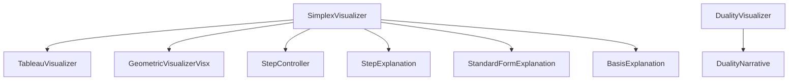

# CLAUDE.md - Components Directory

> [!NOTE]
> This file provides guidance to Claude Code when working with visualization and UI components in the src/components directory.

## Component Architecture Overview

The components follow a clear separation of concerns:



## Core Visualization Components

### SimplexVisualizer.tsx
The main orchestrator component that:
- Manages the complete solution flow
- Coordinates multiple visualizations
- Handles step navigation state

**Key State Management:**
```typescript
const [currentStepIndex, setCurrentStepIndex] = useState(0);
const [selectedCell, setSelectedCell] = useState<{row: number, col: number} | null>(null);
```

### TableauVisualizer.tsx
Interactive tableau display featuring:
- Pivot cell highlighting on hover
- Phase indicators (Phase I/II)
- Basic/non-basic variable labels
- Color coding for entering/leaving variables

**Interaction Pattern:**
```typescript
// Highlight pivot cell on hover
onMouseEnter={() => setHoveredCell({row, col})}
onMouseLeave={() => setHoveredCell(null)}
```

### GeometricVisualizerVisx.tsx
2D visualization using Visx (D3.js wrapper):
- Constraint lines and feasible region
- Objective function contours
- Optimal point highlighting
- Responsive scaling with margins

**Scaling Approach:**
```typescript
const xScale = scaleLinear({
  domain: [0, xMax * 1.2],
  range: [0, innerWidth]
});
```

## Educational Components

### StepExplanation.tsx
Generates contextual explanations for each algorithm step:

```typescript
// Example explanation patterns
if (step.phase === 'I') {
  return "Fase I: Procurando uma solução básica viável inicial...";
}
if (step.status === 'optimal') {
  return "Solução ótima encontrada!";
}
```

### StandardFormExplanation.tsx
Explains the conversion process with:
- Before/after comparisons
- Step-by-step transformation details
- Variable mapping tables

## Input Components

### StructuredProblemForm.tsx
Form-based input with:
- Dynamic constraint addition/removal
- Variable restriction toggles
- Input validation
- Real-time preview

**Validation Pattern:**
```typescript
// Ensure at least 2 variables and 1 constraint
if (variables.length < 2) {
  alert("Pelo menos 2 variáveis são necessárias");
  return;
}
```

### BasisExplanation.tsx
Educational component that:
- Explains basis concepts in linear programming
- Shows which variables are basic vs non-basic
- Helps users understand the simplex method fundamentals

## Duality Components

### DualityVisualizer.tsx
Main duality component coordinating:
- Primal-dual conversion display
- Side-by-side problem comparison
- Economic interpretation
- Theorem demonstrations

### DualityNarrative.tsx
Interactive storytelling approach:
- Real-world scenario (bakery example)
- Step-by-step duality concepts
- Visual aids and animations

## UI Component Library

Located in `/ui/`, these are shadcn/ui components:
- Consistent styling with Tailwind CSS
- Accessible by default
- Customizable through className props

**Usage Example:**
```typescript
<Card className="p-4">
  <CardHeader>
    <CardTitle>Resultado</CardTitle>
  </CardHeader>
  <CardContent>
    {/* Content */}
  </CardContent>
</Card>
```

## Component Patterns

### Props Interface Pattern
```typescript
interface ComponentProps {
  lp: LinearProgram;
  steps?: SimplexStep[];
  onStepChange?: (index: number) => void;
}
```

### Responsive Design Pattern
```typescript
// Use Tailwind breakpoints
<div className="grid grid-cols-1 md:grid-cols-2 gap-4">
  {/* Responsive grid layout */}
</div>
```

### State Lifting Pattern
Child components communicate via callbacks:
```typescript
// Parent
<StepController 
  onStepChange={(index) => setCurrentStepIndex(index)}
/>

// Child
props.onStepChange(newIndex);
```

## Common Modifications

### Adding New Visualizations
1. Create component in src/components/
2. Import in SimplexVisualizer or appropriate parent
3. Add to the visualization flow
4. Update types if needed

### Customizing Educational Content
Edit explanation logic in:
- `StepExplanation.tsx` for algorithm steps
- `StandardFormExplanation.tsx` for conversions
- `BasisExplanation.tsx` for concept explanations

### Styling Updates
- Use Tailwind classes for consistency
- Follow existing color scheme (blue-600 for primary)
- Maintain Portuguese language in all UI text

## Performance Considerations

✅ **Good Practices:**
- Memoize expensive calculations with useMemo
- Use key props for dynamic lists
- Lazy load heavy visualizations if needed

❌ **Avoid:**
- Inline function definitions in render
- Direct DOM manipulation
- Large component files (split when > 300 lines)

## Testing Components

When testing visualization components:
```typescript
// Mock the LP problem
const mockProblem: LinearProgram = {
  objective: [3, 2],
  constraints: [...],
  isMaximization: true,
  variables: ['x1', 'x2']
};

// Test rendering and interactions
render(<SimplexVisualizer lp={mockProblem} />);
```

## References
- Algorithm implementations: @src/lib/CLAUDE.md
- Type definitions: @src/components/types.ts
- Main app structure: @src/CLAUDE.md