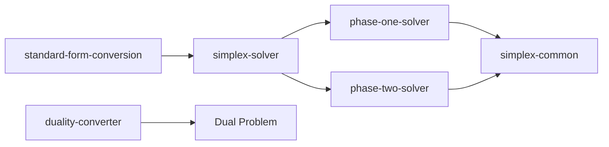

# CLAUDE.md - lib Directory

> [!NOTE]
> This file provides guidance to Claude Code when working with the algorithm implementations in the src/lib directory.

## Algorithm Architecture

The lib directory contains the core linear programming algorithms with a clear separation between phases:



## Core Algorithm Files

### simplex-solver.ts
Main orchestrator that coordinates the Two-Phase Simplex method:

```typescript
export function solveWithSteps(lp: LinearProgram): SimplexResult {
  // 1. Initialize tableau
  const initialTableau = initializeTableau(lp);
  
  // 2. Phase I if needed (find feasible solution)
  if (needsPhaseOne(initialTableau)) {
    const phaseOneResult = solvePhaseOne(initialTableau);
    if (!phaseOneResult.feasible) return { status: 'infeasible' };
  }
  
  // 3. Phase II (optimize)
  return solvePhaseTwo(tableau);
}
```

**Key Functions:**
- `solveWithSteps()` - Main entry point returning all solution steps
- `needsPhaseOne()` - Determines if artificial variables are needed
- `validateTableau()` - Ensures tableau consistency

### phase-one-solver.ts
Finds initial basic feasible solution using artificial variables:

```typescript
// Phase I objective: minimize sum of artificial variables
function createPhaseOneObjective(tableau: PhaseOneTableau): number[] {
  // Sets coefficient -1 for artificial variables, 0 for others
}
```

**Important Concepts:**
- Artificial variables added for ≥ and = constraints
- Phase I succeeds if all artificial variables = 0
- Transitions to Phase II by removing artificial columns

### phase-two-solver.ts
Optimizes the original objective function:

```typescript
function solvePhaseTwo(tableau: PhaseTwoTableau): SimplexStep[] {
  while (!isOptimal(tableau)) {
    const enteringVar = selectEnteringVariable(tableau);
    const leavingVar = selectLeavingVariable(tableau, enteringVar);
    pivot(tableau, enteringVar, leavingVar);
  }
}
```

**Optimality Check:**
- Maximization: all reduced costs ≤ 0
- Minimization: all reduced costs ≥ 0

### simplex-common.ts
Shared utilities for both phases:

```typescript
// Pivot operation - core of simplex algorithm
export function pivot(
  tableau: SimplexTableau,
  enteringVar: number,
  leavingVarRow: number
): void {
  // 1. Divide pivot row by pivot element
  // 2. Update other rows using row operations
  // 3. Update basis
}
```

**Key Operations:**
- `selectEnteringVariable()` - Bland's rule or largest coefficient
- `selectLeavingVariable()` - Minimum ratio test
- `calculateReducedCosts()` - For optimality checking

## Conversion Algorithms

### standard-form-conversion.ts
Converts any LP to standard form with explanations:

```typescript
export function convertToStandardFormWithExplanation(lp: LinearProgram): {
  standardLP: LinearProgram;
  explanation: string;
  variableMapping: VariableMapping[];
} {
  // 1. Convert to minimization
  // 2. Add slack/surplus variables
  // 3. Handle unrestricted variables (x = x+ - x-)
  // 4. Generate detailed explanation
}
```

**Conversion Rules:**
- Maximization → Minimization: negate objective
- Inequality → Equality: add slack/surplus variables
- Unrestricted → Non-negative: split into positive/negative parts

### duality-converter.ts
Converts primal problems to dual form:

```typescript
export function convertToDual(primal: LinearProgram): LinearProgram {
  // Primal Max ↔ Dual Min
  // Primal constraints → Dual variables
  // Primal variables → Dual constraints
}
```

**Duality Rules:**
```
Primal (Max)          | Dual (Min)
---------------------|-------------------
Variable xⱼ ≥ 0      | Constraint ≥ bⱼ
Variable xⱼ ≤ 0      | Constraint ≤ bⱼ
Variable xⱼ free     | Constraint = bⱼ
Constraint ≤ aᵢ      | Variable yᵢ ≥ 0
Constraint ≥ aᵢ      | Variable yᵢ ≤ 0
Constraint = aᵢ      | Variable yᵢ free
```

## Testing Patterns

### Test Structure
```typescript
describe('simplex-solver', () => {
  test('solves basic maximization problem', () => {
    const problem: LinearProgram = {
      objective: [3, 2],
      constraints: [
        { coefficients: [2, 1], rhs: 10, operator: '<=' }
      ],
      isMaximization: true,
      variables: ['x1', 'x2']
    };
    
    const result = solveWithSteps(problem);
    expect(result.status).toBe('optimal');
    expect(result.objectiveValue).toBeCloseTo(15);
  });
});
```

### Edge Cases to Test
- Infeasible problems (contradictory constraints)
- Unbounded problems (no finite optimum)
- Degenerate problems (multiple optimal bases)
- Problems with equality constraints
- Problems with unrestricted variables

## Algorithm Implementation Details

### Tableau Structure
```typescript
interface SimplexTableau {
  matrix: number[][];      // A matrix with RHS
  basis: number[];         // Current basic variables
  objectiveRow: number[];  // Reduced costs
  basicValues: number[];   // Values of basic variables
}
```

### Numerical Stability
- Use epsilon comparisons for floating point: `Math.abs(value) < 1e-10`
- Avoid division by very small numbers
- Check for cycling (rare but possible)

### Performance Considerations
✅ **Efficient Patterns:**
```typescript
// Pre-allocate arrays
const row = new Array(n).fill(0);

// Use in-place operations
for (let j = 0; j < n; j++) {
  tableau.matrix[i][j] /= pivotElement;
}
```

❌ **Avoid:**
```typescript
// Creating new arrays in loops
const newRow = row.map(val => val / pivot);

// Repeated calculations
for (let i = 0; i < m; i++) {
  const ratio = calculateRatio(); // Don't recalculate
}
```

## Common Modifications

### Adding New Constraint Types
1. Update `Constraint` type in types.ts
2. Modify `convertToStandardFormWithExplanation()`
3. Update constraint handling in `initializeTableau()`
4. Add test cases

### Implementing Alternative Pivot Rules
Replace `selectEnteringVariable()` in simplex-common.ts:
```typescript
// Steepest edge rule
function selectEnteringVariableSteepestEdge(tableau: SimplexTableau): number {
  // Implementation
}
```

### Adding Solution Analysis
Extend `SimplexResult` to include:
- Sensitivity analysis
- Shadow prices
- Reduced cost ranges
- Basis stability

## Debugging Tips

### Common Issues

**Problem: "Infeasible" when solution exists**
- Check standard form conversion
- Verify artificial variable initialization
- Ensure Phase I objective is correct

**Problem: "Cycling" in degenerate problems**
- Implement Bland's rule for tie-breaking
- Add cycle detection
- Use perturbation method

**Problem: Numerical errors**
- Check epsilon values
- Verify pivot element is not too small
- Consider scaling the problem

### Debugging Helpers
```typescript
// Add to tableau for debugging
function printTableau(tableau: SimplexTableau): void {
  console.table(tableau.matrix);
  console.log('Basis:', tableau.basis);
  console.log('Objective:', tableau.objectiveRow);
}
```

## References
- Component usage: @src/components/CLAUDE.md
- Type definitions: @src/components/types.ts
- Test examples: simplex-solver.test.ts, standard-form-conversion.test.ts